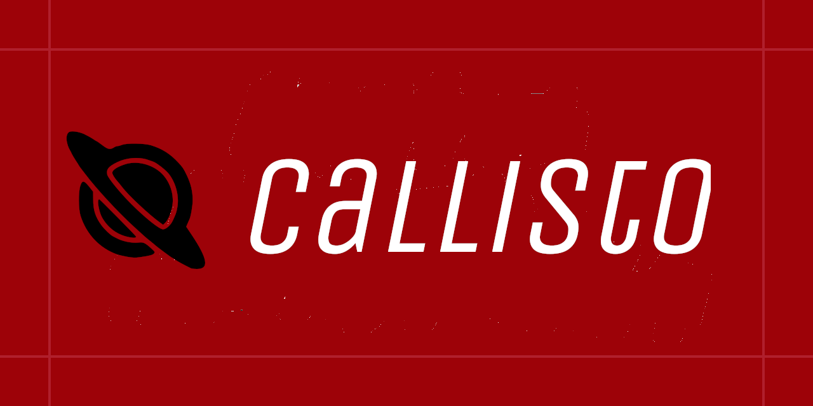

# Callisto

---

## A self-hosted cross-platform app to share your clipboard across all devices ✍🏽

---

## 🤓 This project follows the Monorepo approach

Which means:

- `server/` folder contains all the logic for the server to be self-hosted
- `callisto-app/callisto` folder contains the client-side flutter app which will run on all your devices

## To-Do

- [ ] Package the server into a docker app for easy deployment
- [ ] Release packages for all platforms
- [ ] Change auth to using TLS encryption in LAN instead of restAPI auth (similar to KDE Connect)
- [ ] Automate building packages and deployment using Github Actions
- [ ] Improve API security
- [ ] Add clipboard encryption
