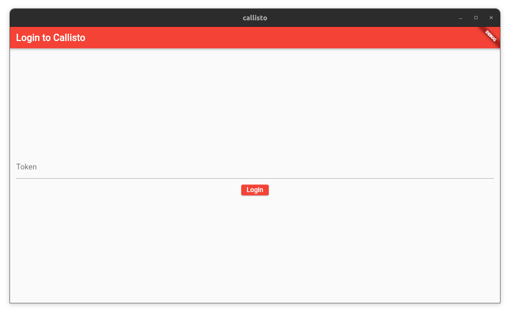

# Callisto

---

## A self-hosted cross-platform app to share your clipboard across all devices ✍🏽


---

## Screenshots




---

## How to run 

### Server
Using docker is the recommended way. 

Navigate into the `server/` directory. Create a file named `pass` and add whatever you want the authentication token to be. Since you don't really need to memorise it, it's better to use a long random string. `head -c 500 /dev/urandom | tr -dc 'a-zA-Z0-9~!@#$%^&*_-' > pass` can be used on linux systems. From there, build the docker image.

```sh
$ docker build -t <image-name> 
```
To run it
```sh
$ docker run -dp PORT:4096 <image-name>
```
The http server inside the docker will bind with PORT of the localhost and can receive requests on `127.0.0.1:PORT`


## 🤓 This project follows the Monorepo approach

Which means:

- `server/` folder contains all the logic for the server to be self-hosted
- `callisto-app/callisto` folder contains the client-side flutter app which will run on all your devices

## To-Do

- [✓] Package the server into a docker app for easy deployment
- [ ] Release packages for all platforms
- [ ] Change auth to using TLS encryption in LAN instead of restAPI auth (similar to KDE Connect)
- [ ] Automate building packages and deployment using Github Actions
- [ ] Improve API security
- [ ] Add clipboard encryption
- [ ] Add device discoverability on LAN using mDNS (akin to avahi)
- [ ] Improve UI :)
